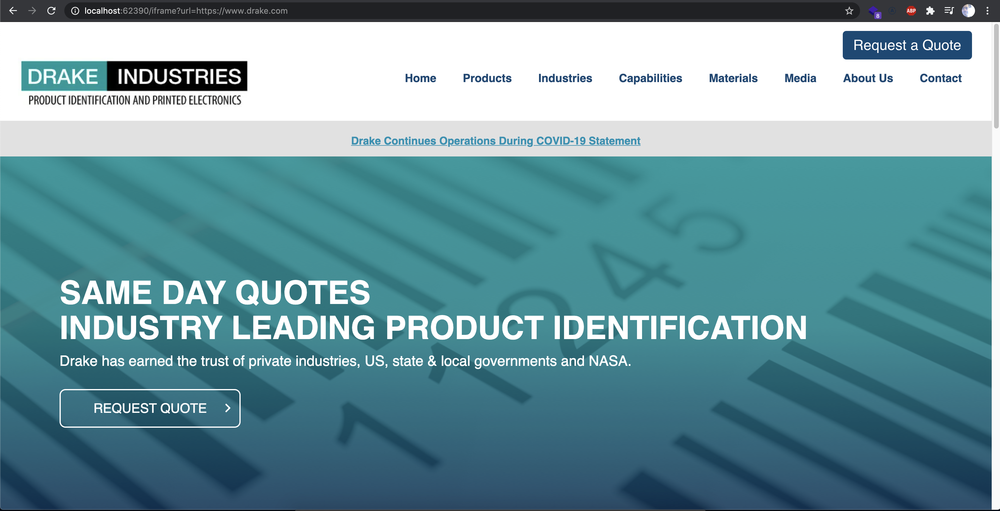

# node-iframe-example

Example application for `node-iframe`, render iframes on your server using node.js.
This project can be used to Proxy or domain front. [node-iframe](https://github.com/A11yWatch/node-iframe)

## Getting Started

1. `npm install`
2. `npm run dev`

## Example

Pass in the port that is logged into the console in place of `:62390`

`http://localhost:62390/iframe?url=https://www.drake.com`

## LICENSE

check the license file in the root of the project.
